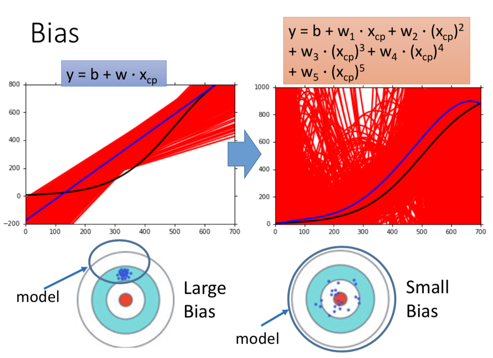
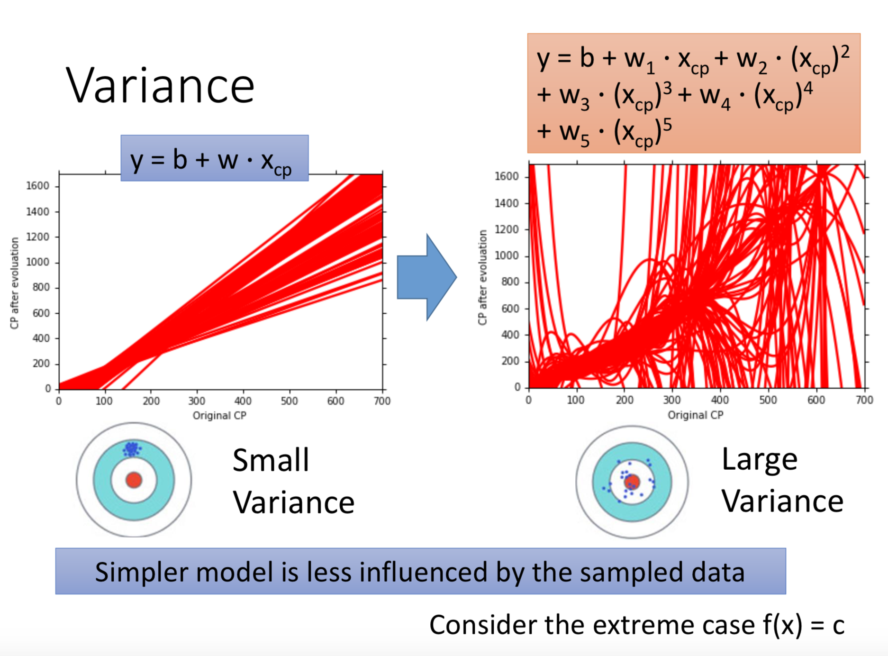
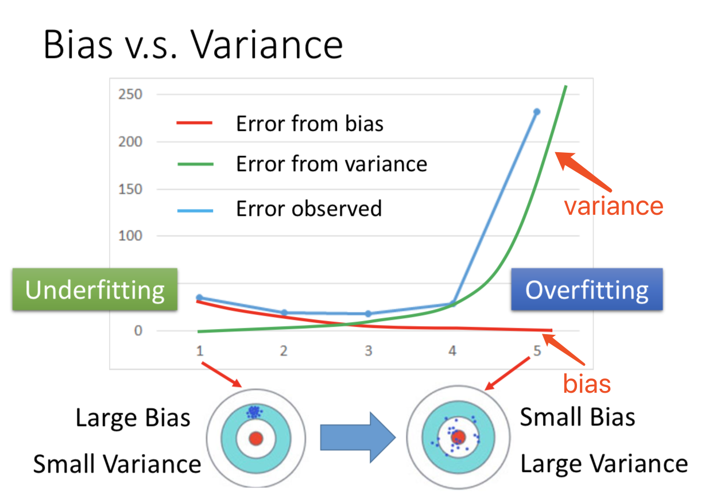

# 学习理论之误差和方差

> 下面的总结来源于台湾大学李宏毅老师2016年的**机器学习**课程第5课 **Where does the error come from?**

[TOC]

一般地，训练模型在测试数据上的误差主要来源于两个方面，一个是模型的**误差（bias）**，另一个是模型的**方差（variance）**。

在测试数据上，较复杂的模型不一定能够取得很好的性能。

我们训练得到的模型 $\hat{f}(x)$ 只是对于真实函数 $f(x)$ 的一种估计（当然实际中并不知道 $f(x)$ 的表达式）。

我们训练得到的函数只是参数空间中的一个点，举个例子，比如我们的假设集（hypothesis set）为 $\hat{y}(x) = \omega\,x + b$，那么我们需要确定的参数只有两个，因此我们的参数空间就是某个平面（比如说一个圆），而我们最终求得的函数只是这个平面上的一点，因此训练得到的函数可以看成是参数空间中的一点。

## 误差（Bias）的结论

**越是简单的模型，其误差就越大；而越是复杂的模型，其误差就越小**。可以这么解释，简单模型的参数空间的取值范围较小，可能不包括目标函数的参数取值；与之相反，复杂模型的参数空间的取值范围较大，可能会包含目标函数的参数取值。

## 方差（Variance）的结论

**越是简单的模型，其方差就越小**，极端的情况就是 $f(x) = c$ ，此时的方差为 $0$；与之相反，**越是复杂的模型，其方差就越大**。可以这么解释，简单模型的参数空间的取值范围很小，因此无论最后取什么值，各个取值之间的“距离”都不会太大；而复杂模型的参数空间的取值范围很大，因此各个取值之间的“距离”是存在比较大的差异的。总而言之，**越简单的模型越不易受到训练数据的影响**。

## 误差 v.s. 方差

在实际中，最好在两种误差之间进行权衡，使得总的误差最小。

## 应对方法

对于欠拟合（Underfitting），即误差（Bias）较大的情况：

- 重新选择一个更加复杂的模型
- 添加更多的特征

对于过拟合（Overfitting），即方差（Variance）较大的情况：

- 更多的数据（理想情况）
- 正则化