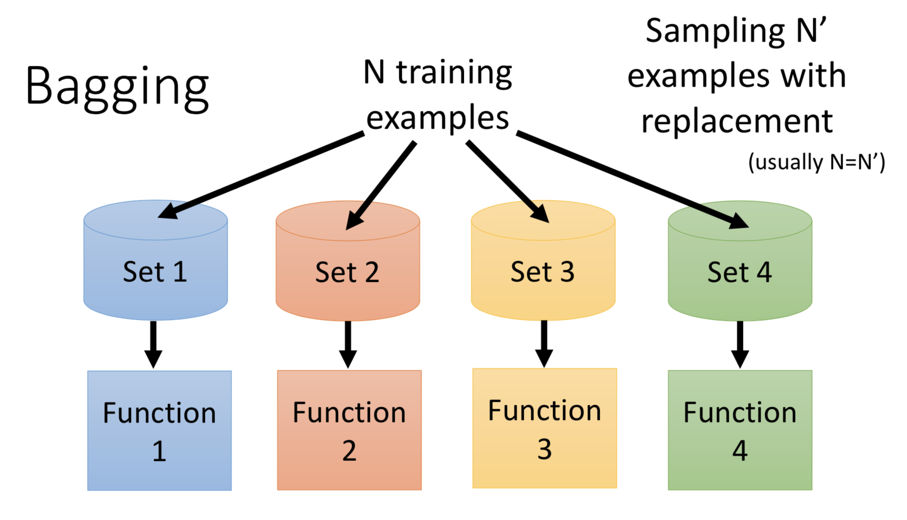
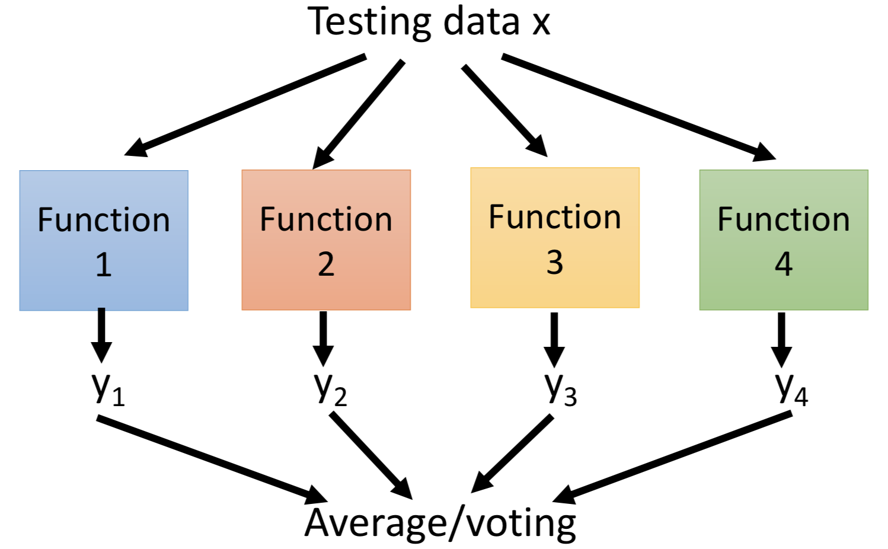

# 集成学习

> 下面的内容是台湾大学李宏毅老师2016年**机器学习**课程第27课 **Ensemble** 的笔记。

---

一些记录在本子上的东西，觉得还可以留着。

- 学习能力强的分类器误差（Bias）较小、方差（Variance）较大，对多个强分类器的结果进行平均或者投票可以减小方差，避免过拟合
- 李宏毅老师：Bagging做的事情和Boosting做的事情是完全相反的，Bagging是想办法让overfitting的model不那么容易overfitting，Boosting则是让underfitting的model提升它们的performance，能够去拟合训练数据

---

[TOC]

## 1 前言

集成方法（Ensemble）就像是一堆的算法一起去打“群架”。

## 2 Bagging

从学习理论可以知道，复杂的模型误差（Bias）较小，但是方差（Variance）较大。因此，如果我们能够把所有学习到的函数加起来做平均，将会使得最后得到的结果更加接近目标函数，减少单一模型的方差，从而避免过拟合。而 Bagging 正是采用这种思路。

Bagging 的训练和预测过程如下面的两个图所示。首先，将训练数据分成几份，每一份数据都可以是不一样的；接着，根据分出来的数据，训练出几个不一样模型；最后，我们用得到的模型分别预测测试数据，并将得到的结果取平均或者投票。

总而言之，**Bagging 比较适合在模型能力过强的时候使用**，它能够对几个能力较强的模型的结果进行约束，使得得到的结果更加平滑，避免了过拟合。

## 3 Boosting

### 3.1 Adaboost

